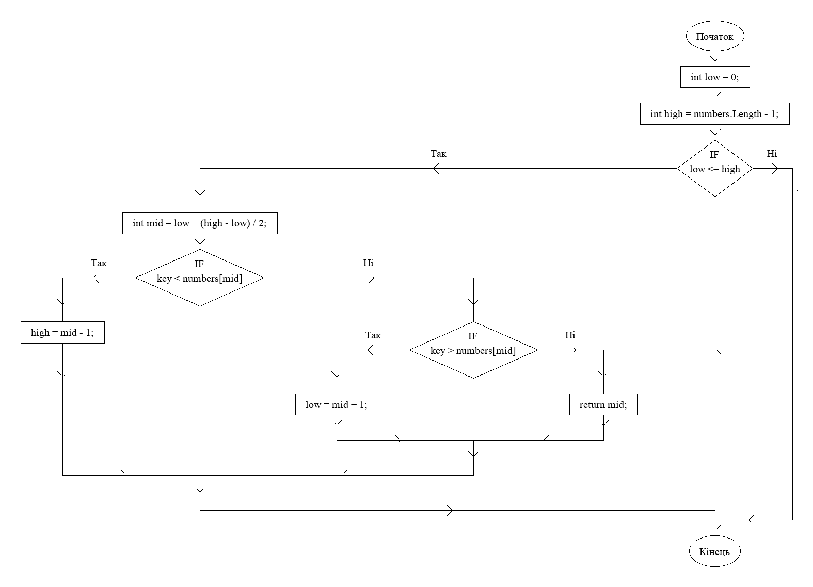
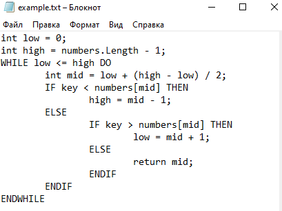

# Flowchart-Generator
Автоматически создает блок-схемы из псевдокода!


### Авторство

Оригинальным автором данного инструмента является MugilanGN, я лишь сделал форк.
Ссылка на оригинальный инструмент: https://github.com/MugilanGN/Flowchart-Generator

## Видео демонстрация

https://www.youtube.com/watch?v=1gCqPBzU8Z0


## Установка Repl.it

Если вы не хотите скачивать его или настраивать python, вы можете запустить этот проект прямо из браузера с помощью [repl.it](https://repl.it/github/CallMeShepard/CallMeShepard-Flowchart-Generator).

Эта ссылка автоматически клонирует проект и настроит его для вас. Если вы хотите сделать это вручную, вы можете самостоятельно импортировать **replit.com/github/CallMeShepard/CallMeShepard-Flowchart-Generator** в repl.it.

После этого вы можете отредактировать файл enter.txt в проекте repl и заменить его своим собственным псевдокодом и затем можете выполнять команды из раздела [CLI Usage](#использование-командной-строки) в README в терминале repl.it.

## Локальная установка

Этот проект был собран на Python 3.7.4.

Запустите это для установки необходимых зависимостей:

```sh 
pip install Pillow click
```

Затем клонируйте этот проект на свою систему.

## Написание псевдокода

Псевдокод вводится в файл .txt. Он следует строгим правилам, которые должны соблюдаться



### Правила

STOP и START вводятся программой автоматически, поэтому их добавлять не нужно

Отступы не влияют на работу программы, поэтому ничего не нужно отступать, а неправильные отступы допускаются

Капитализация ключевых слов чрезвычайно важна. Если возникает ошибка, дважды проверьте, правильно ли вы написали заглавными буквами такие ключевые слова, как "TO" и "FOR".

ELSE IF недоступен, но вложенные IF возможны

Блоки ENDIF, NEXT var и ENDWHILE являются обязательными.

### Руководство по синтаксису

 #### Входные и выходные:

  Ввод -  ```INPUT```, ```Input```, ```input```, ```CIN```, ```cin```
  Вывод - ```OUTPUT```, ```COUT```, ```cout```, ```PRINT```, ```print```, ```printf```

   ```sh
   INPUT X
   cin >> poggers
   OUTPUT poggers
   OUTPUT "bruh?"
   cout << lmao
   ```
#### Условный оператор IF:
  - IF condition THEN
  - ELSE
  - ENDIF
  
  ```sh
  IF x < 3 THEN
    OUTPUT X
  ELSE
    OUTPUT x*2
  ENDIF
  ```
  Оператор else является необязательным (ENDIF по-прежнему необходим)
  
   ```sh
  IF x < 3 THEN
    OUTPUT X
  ENDIF
  ```
  
  #### Блоки операций:

  ```sh
  x = x + 1
  y = x / 2
  ```
  
  #### Циклы while:

  - WHILE condition DO
  - ENDWHILE
  
  ```sh
  WHILE x < 5 DO
    OUTPUT x
  ENDWHILE
  ```
  #### Циклы for:
   
  - FOR var <- start TO end
  - NEXT var
  
  ```sh
  FOR i <- 1 TO 5
    OUTPUT i
  NEXT i
  ```

## Использование командной строки

Чтобы запустить код сначала откройте папку с скачанным репозиторием и скопируйте путь к нему.
Затем введите ```cd ```*```путь```*

Потом выполните следующую команду:
```sh
python main.py
```

### Аргументы
  
  Аргументы в командной строке вводятся следующим образом: ``--size=20`` или ``--code="enter.txt"``.
 
  - ```--size``` - размер используемого шрифта. Он также управляет размером всей блок-схемы. По умолчанию он равен 20px
  - ```--font``` - путь к шрифту. По умолчанию используется шрифт Times New Roman по адресу "./fonts/", но его можно изменить для различных ОС или шрифтов.
  - ```--output``` - файл изображения блок-схемы. По умолчанию "flowchart.png".
  - ```--code``` - файл с псевдокодом. По умолчанию "enter.txt"
  - ```--help``` вызов справки
  
  Пример:
  
  ```sh
  python main.py --code="code.txt" --size=30 --output="result.png"
  ```

### Изображение блок-схемы

Изображение ```flowchart.png```содержит созданную блок-схему. Размер изображения зависит от размера созданной блок-схемы, поэтому он может достигать разрешения 10 тыс. пикселей! Однако если созданная блок-схема слишком велика, то изображение будет невозможно открыть из-за слишком большого размера. Пользователь должен быть осторожен с размерами блок-схем.
